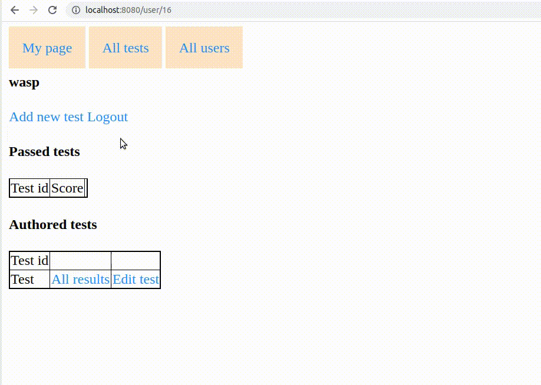

## Test Environment
#### Spring web MVC application for creating, editing and passing test

Technologies:
* Spring Boot
* JPA
* PostgreSQL
* Thymeleaf
* Hibernate Validator
* Spring Security

Demo (1):

Demo (2):

Simple specification:
* You can register new user, or login with existed one.
* User can open page of another user
* Any user can pass any test
* * User can see their results
* User (author) can crete test
* * Author can see results of all users, who passed their test
* * Author can edit their tests
